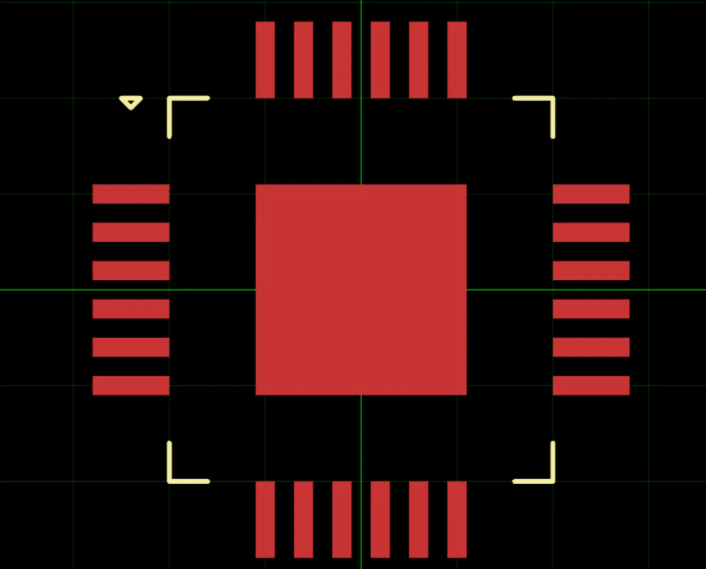

tscircuit is a great project to contribute to if you're familiar with Typescript
and React.

tscircuit is composed of over 200 repositories, but every project uses [bun](https://bun.sh),
so make sure to install bun before you start contributing.

To contribute to tscircuit, you need to make [Pull Requests](https://docs.github.com/en/pull-requests/collaborating-with-pull-requests/proposing-changes-to-your-work-with-pull-requests/about-pull-requests) from a fork of a repository.

## Before You Start

1. Make sure bun is installed on your system
2. Make sure you've signed up at [tscircuit.com](https://tscircuit.com) and have followed a tutorial in the docs to create a circuit board

## Recommended Contribution Order

We recommend the following order for contributing to tscircuit. Contributing to repositories in this order will make sure you have a good understanding of the tscircuit ecosystem.

If you're not able to find an issue in the repo, ask on discord! Maintainers often forget to create issues even though there are many problems they need solved!

## 1. [tscircuit/schematic-symbols](https://github.com/tscircuit/schematic-symbols)

Difficulty: ⭐ (easy) · [] · [Issues](https://github.com/tscircuit/schematic-symbols/issues) · [Repo](https://github.com/tscircuit/schematic-symbols)

This is a large repository of schematic symbols, you can view the [symbols here](https://symbols.tscircuit.com)

We also have a [video tutorial](https://blog.tscircuit.com/i/149495167/help-us-build-the-largest-library-of-schematic-symbols) for contributing to this project!

## 2. [tscircuit/footprinter](https://github.com/tscircuit/footprinter)

Difficulty: ⭐⭐ (medium) · [] · [Issues](https://github.com/tscircuit/footprinter/issues) · [Repo](https://github.com/tscircuit/footprinter)

This is a project that generates the "footprint" where a chip is placed on a circuit board from a string.

For example, you might turn the string "quad24" into the image below:

Here's the [video tutorial for contributing to footprinter](https://blog.tscircuit.com/p/learn-how-to-contribute-to-tscircuits)

## 3. [tscircuit/cli](https://github.com/tscircuit/cli)

Difficulty: ⭐⭐ (medium) · [] · [Issues](https://github.com/tscircuit/cli/issues) · [Repo](https://github.com/tscircuit/cli)

This is the main development tool for tscircuit. It provides a local development server and package management. The CLI is what you use when you run `tsci dev` or `tsci init`.

## 4. [tscircuit.com](https://github.com/tscircuit/tscircuit.com)

Difficulty: ⭐⭐ (medium) · [] · [Issues](https://github.com/tscircuit/tscircuit.com/issues) · [Repo](https://github.com/tscircuit/tscircuit.com)

This is the main website for tscircuit, it features an editor for circuit boards! You should try it at [tscircuit.com](https://tscircuit.com)!

There are a lot of issues in this repo,

## 5. [circuit-to-svg](https://github.com/tscircuit/circuit-to-svg)

Difficulty: ⭐⭐ (medium) · [] · [Issues](https://github.com/tscircuit/circuit-to-svg/issues) · [Repo](https://github.com/tscircuit/circuit-to-svg)

This is a library that converts [Circuit JSON](https://github.com/tscircuit/circuit-json) into SVG files. We use
this all over the place, including in almost all of our
tests!

## 6. [tscircuit/core](https://github.com/tscircuit/core)

Difficulty: ⭐⭐⭐ (hard) · [] · [Issues](https://github.com/tscircuit/core/issues) · [Repo](https://github.com/tscircuit/core)

This is the core library that powers tscircuit. It contains all the logic for converting React components into circuit boards, schematics and PCBs.

The core library is written in Typescript and uses React. It's a great project to contribute to if you want to learn about how tscircuit works under the hood.

Here's a [video tutorial for contributing to core](https://blog.tscircuit.com/p/learn-how-to-contribute-to-tscircuits-core).
